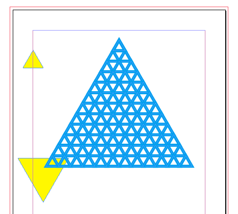

# triangle.jsx

create an equilateral triangle for indesign.jsx

## Usage

read `example.jsx`

~~~javascript
#target "indesign-7.0"
#include "/PATH/TO/triangle/index.jsx"

// create an equilateral triangle
// opts can set polygon properties
// by default, opts depends on document setting

var opts = {fillColor:"None", strokeColor:"Black", strokeWeight:1, appliedObjectStyle:"OBJ_STYLE", label:"triangle"};

// arguments:
// - top_coordinates /* array of 2 */
// - side_length /* integer, float */
// - opts

eq_triangle([20, 40], 20, opts);
// =>▲

// reflected triangle minus value for side_length
eq_triangle([20, 40], -20, opts);
// =>▼

// create a stack of triangles

// arguments:
// - stack /* integer */
// - start_coordinates /* array of 2 */
// - side_length /* number */
// - opts

stacked_triangles(3, [100, 0], 10, opts);
//   ▲
//  ▲▲
// ▲▲▲

~~~
